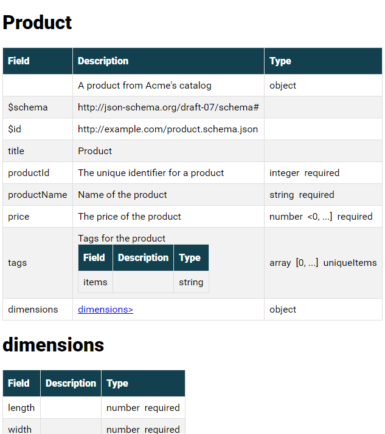
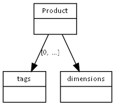

# About this code

A prototype of a simple utility to be able to embed more comprehensive documentation within a JSON Schema.

Written by Lars Reed, 2021-2023. I'd love an attribution if you use this code for anything ;)

# Writing schemas

## Create a pure JSON Schema

Start off by creating your actual schema, as per https://json-schema.org/.

For precise vocabulary, see https://tools.ietf.org/html/draft-bhutton-json-schema-validation-00.

## Additional information

* Decide on the headings you want for additional information, e.g. "Sample values".
  Add these as separate properties to the schema, alongside the regular schema keywords,
  but prefix the names with **"x-"**, and replace spaces with underscores -- i.e. *x-sample_values*.
  Such values will appear in the documentation, but will be stripped from the recreated schema output (see below).
* You may also append other properties that appear neither in the documentation nor in the schema
  by starting the property names with **"ignore-"**.
* JSON is not fond of repeated attributes, and does not allow a string property to span multiple input lines.
  To include multi-line strings, use `\n` to denote where you want line breaks, but don't actually add any line breaks.
  We should perhaps fix that, some day...
* To embed *links* in documentation, use either `linkTo(url)` or `linkTo(url, text)`
  (for the former, the url is also used as the actual link text).

* Sample:
```json
        "eventId" : {
            "type": "string",
            "description": "UUID v4 format",
            "pattern": "^[0-9a-f]{8}-[0-9a-f]{4}-[0-9a-f]{4}-[0-9a-f]{4}-[0-9a-f]{12}$",
            "x-My_additional_info": "is recorded here",
            "ignore-this" : "is ignored"
        },
```

## Introduce conditionals

You can introduce conditions. Give your condition a name, e.g. `variant`
and a set of possible values, e.g. `complete` and `concise`.
Then you can add one of the following conditionals to exclude a given node -- **and** all its children -- thus:

1. `"xif-variant" : "foo"` (where "variant" is your chosen condition name),
   the node (with children) will be included if 'variant' is undefined or defined and equal to "foo".

2. `"xif-variant" : "foo, bar"` like the previous, but both "foo" and "bar" are acceptable values.
   Legal values are separated by a comma ("foo, bar, baz" etc).

3. `"xifnot-variant" : "foo"`, the node will be included if 'variant' is undefined
   or if it is given, but not as "foo".

4. `"xifnot-variant" : "foo, bar, baz"`, like the previous, but a list of values are accepted here as well.

More below on how to define conditions, as well as how to exclude tables/graph nodes and columns.

# Producing documentation

Currently, four types of documentation are supported.

## HTML

To create an HTML document documenting the schema, run a visitor like this

java -jar jsondoc.jar HTML /path/to/input/myExtendedSchema.json -DembedUpToRows=1 > mySchema.html`

Sample output:



The definition `excludedColumns=foo,bar` may be appended
defining one or more (comma separated) columns to exclude from the result.

The definition `skipTables=foo,bar` may be appended
defining one or more (comma separated) table IDs to exclude from the result.
Note that these are the `id`-tags, look in the generated code if you are uncertain.

The definition `embedUpToRows=n` (where 'n' is a number) may be appended,
denoting that tables of up to N rows should be embedded in its parent.

Use `lang=xy` to change default setting of lang=en on the root element.

A sample with such definitions:
`java -jar jsondoc.jar HTML myExtendedSchema.json embedUpToRows=1 excludedColumns=sample,note lang=no > myLittleSchema.html`


## Wiki

Like the HTML version, but using Confluence wiki link syntax.
`java -jar jsondoc.jar WIKI /path/to/input/myExtendedSchema.json > mySchema.xhtml`


## Markdown

Like the HTML version (same parameters etc), but producing Markdown.
`java -jar jsondoc.jar MARKDOWN /path/to/input/myExtendedSchema.json > mySchema.md`


## Diagram

Requires Graphviz -- https://graphviz.org/download/

First: create the dot input:
`java -jar jsondoc.jar GRAPH /path/to/input/myExtendedSchema.json > mySchema.txt`

Then: create a diagram from the dot script:
`& 'C:\Program Files\Graphviz\bin\dot' -T png -o mySchema.png mySchema.txt`

Sample output:



# Validation and samples

## Creating sample data

Note: this feature is experimental, you will probably have to correct the output somewhat...

Create sample data from one or more embedded sample columns:

`java -jar jsondoc.jar SAMPLE /path/to/input/myExtendedSchema.json sampleColumns=x-sample> mySample.json`

You can define one or more (comma-separated) sample columns using `sampleColumns=...` as shown above.
Without any such column given or present, we will try the JSON Schema standard `examples` array if present
(if the array is present, but empty, no sample will be generated for that column),
or, if the attribute is a const or enum, use one of those,
or, as a last resort, try to generate a value based on the data type.

## Extracting schema for validation

The schema, without the documentation and ignored properties, can be recreated
for use in e.g. external validators, like this:

`java -jar jsondoc.jar SCHEMA /path/to/input/myExtendedSchema.json > myBasicSchema.json`

If the definition `strict=true` is provided together with SCHEMA, an `additionalProperties: false`-clause
is added to all `properties` in the schema, likewise, `additionalItems: false` is added to besides any "items" within an array.
Strict indicates that no other properties than those explicitly mentioned
in the schema are allowed (JSON Schema is normally lax about this).

Definitions (e.g. conditionals), can be given after the input file name with `name=value`, e.g.

`java -jar jsondoc.jar SCHEMA myExtendedSchema.json strict=true variant=plain > myPlainSchema.json`


## Performing validation

You can also use this tool to perform validation of JSON data files against a schema directly (this is done through an embedded
com.github.everit-org.json-schema).

To validate, you

1. supply the schema file as the main input file as usual

2. list all the data files you want to validate, comma separated (make sure to use quotes if there are any spaces in
   the names) as the parameter **files=**, e.g. `files=/data/foo,/tmp/bar`

3. optionally add the parameter `strict=true`, which will (currently, behaviour could be added)
   append a new `"additionalProperties": false`-node to all `properties`-nodes,
   indicating that no attributes except those mentioned in the schema are allowed.

Under the hood, validation is performed against a temporary schema created by running the given
schema through the SCHEMA generator, adding the STRICT behaviour if requested.

Any errors are printed to standard output, the exit is 0 if everything is OK, otherwise >0.

```
java -jar jsondoc.jar VALIDATE /path/to/myExtendedSchema.json files="/path/to/myData.json" strict=true > myReport.txt
[[ $? = 0 ]] || error ....
```

# Command line help
Run `java -jar jsondoc.jar HELP` to get online help.

```text
JSON SCHEMA DOCUMENTATION TOOL -- Lars Reed, 2021
Usage: java -jar jsondoc.jar TYPE SCHEMAFILE [DEFINITIONS] > resultfile

TYPE:
    SCHEMA:   output a clean schema file, without additional attributes
    HTML:     output HTML-formatted documentation
    MARKDOWN: output Markdown-formatted documentation
    GRAPH:    output a script to create a graph using graphviz/dot
    WIKI:     output in Confluence wiki XHTML format
    SAMPLE:   output sample data -- Note: Experimental!
    VALIDATE: perform validation of datafiles against a schema -- Note: Experimental!
SCHEMAFILE: name of extended JSON Schema file
DEFINTIONS: follows the pattern name=value, and comes after the inputfile
    variant=foo could define a context for "xif-variant": "foo"
    excludeColumns=col1,col2,... to exclude named columns
    skipTables=table1,table2,... to exclude tables with given IDs
    embedUpToRows=n defines embedding in HTML tables
    sampleColumns=col1,... defines columns to use for sample output
    files=file1,... required with VALIDATE to name files to validate
    strict=true with VALIDATE to have strict validation
Output is written to stdout and should be redirected.
```

# Maintenance

## JSON Schema

The parser does not yet promise to support all of JSON Schema, it has only been tested on the parts
I have been working with.

TODO:
* more $defs & $ref (?)
* dependencies

Support is currently *not* planned for

* misc. advanced constructs
* maxContains, minContains, contains
* maxProperties, minProperties
* dependentRequired

### $defs and $ref

There is _some_ rudimentary support for this construct.

* If you have anything named `$defs`, its name will be placed in parentheses in tables,
* and incoming edges to a graph node named `$defs` will be dashed.
* If you have a `$ref` to a path beginning with `#/$defs/`, the documentation will contain the ref in brackets
  with an attempted hyperlink

## Code style

Having coded mostly in Scala (and a little Kotlin) lately, some classical Java conventions seem cumbersome...
So the code here is not entirely idiomatic - but it's mine.

* *What? Multiple classes in the same file, and hardly anything public?*

  This is a small utility, and all classes fit nicely within a package. What should `public` do for me?

* *Single line methods*

  Why does a single, short Java statement have to occupy 3+ lines in a file?
  It shouldn't...

* *Direct variable access*

  As I said, the code base is small. I'll introduce accessors when I need to,
  but having to write getters and setters really bugs me. So I generally don't,
  except sometimes for accessing non-finals outside the same file,
  but then I'll skip the get prefix.

* *Etc*

  Live with it :-)

## Libraries
`com.fasterxml.jackson` provides the basic parsing - see https://github.com/FasterXML/jackson

`com.github.everit-org.json-schema` (https://github.com/everit-org/json-schema) provides validation,
this library is distributed under the [Apache License 2.0](https://github.com/everit-org/json-schema/blob/master/LICENSE). 