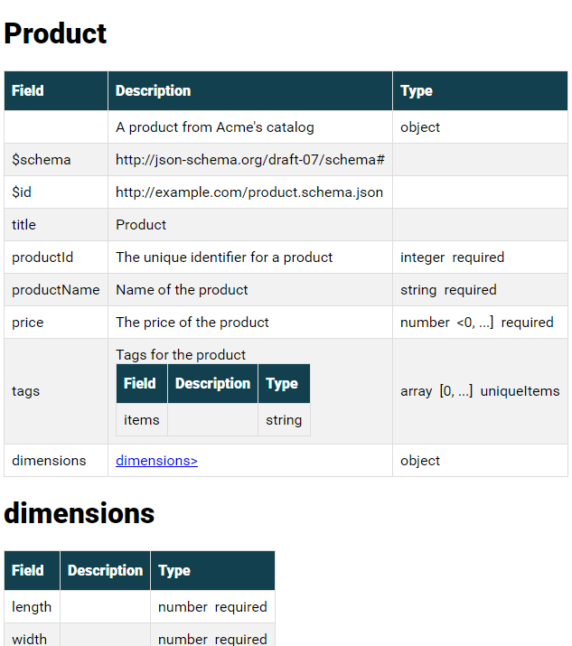
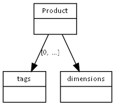

# About this code

A prototype of a simple utility to be able to embed more comprehensive documentation within a JSON Schema.

Written by Lars Reed, april 2021. I'd be happy for an attribution if you use this code for anything ;)

# Writing schemas

* JSON Schema

    Start off by creating your actual schema, as per https://json-schema.org/

* Additional information

    * Decide on the headings you want for additional information, e.g. "Sample values".
      Add these as separate properties to the schema, alongside the regular schema keywords,
      but prefix the names with **"x-"**, and replace spaces with underscores -- i.e. *x-sample_values*.
      Such values will appear in the documentation, but will be stripped from the recreated schema output (see below).
    * You may also append other properties that appear neither in the documentation nor in the schema
      by starting the property names with **"ignore-"**.

* Sample:
```json
        "eventId" : {
          "type": "string",
          "description": "UUID v4 format",
          "pattern": "^[0-9a-f]{8}-[0-9a-f]{4}-[0-9a-f]{4}-[0-9a-f]{4}-[0-9a-f]{12}$",
          "x-My_additional_info": "is recorded here",
          "ignore-this" : "is ignored"
        },
```

* Introduce conditionals

    You can introduce conditions. Give your condition a name, e.g. `variant` 
    and a set of possible values, e.g. `complete` and `concise`. 
    Then you can add one of the following conditionals to exclude a given node -- **and** all its children -- thus: 

    1. `"xif-variant" : "foo"` (where "variant" is your chosen condition name), 
       the node (with children) will be included if 'variant' is undefined or defined and equal to "foo".
       
    2. `"xif-variant" : "foo, bar"` like the previous, but both "foo" and "bar" are acceptable values.
       Legal values are separated by a comma ("foo, bar, baz" etc).
    
    3. `"xifnot-variant" : "foo"`, the node will be included if 'variant' is undefined 
       or if it is given, but not as "foo".

    4. `"xifnot-variant" : "foo, bar, baz"`, like the previous, but a list of values are accepted here as well.

    More below on how to define conditions, as well as how to exclude tables/graph nodes and columns.

# Producing documentation

## **Extracting schema for validation:**

The schema, without the documentation and ignored properties, can be recreated
for use in e.g. validators, like this:

`java -jar jsondoc.jar SCHEMA /path/to/input/myExtendedSchema.json > myBasicSchema.json`

For this, and all following examples, definitions (e.g. conditionals), 
can be given after the input file name with `-Dname=value`, e.g.

`java -jar jsondoc.jar SCHEMA myExtendedSchema.json -Dvariant=plain > myPlainSchema.json`


## **Creating documentation**
  
Currently, three types of documentation are supported.

1. HTML

    To create an HTML document documenting the schema, run a visitor like this

   `java -jar jsondoc.jar HTML /path/to/input/myExtendSchema.json -DembedUpToRows=1 > mySchema.html`

    Sample output:

    

    The definition `-DexcludedColumns=foo,bar` may be appended
    defining one or more (comma separated) columns to exclude from the result.

    The definition `-DskipTables=foo,bar` may be appended
    defining one or more (comma separated) table IDs to exclude from the result.
    Note that these are the `id`-tags, look in the generated code if you are uncertain.

    The definition `-DembedUpToRows=n` (where 'n' is a number) may be appended,
    denoting that tables of up to N rows should be embedded in its parent.

    A sample with such definitions:
    `java -jar jsondoc.jar HTML myExtendSchema.json -DembedUpToRows=1 -DexcludedColumns=sample,note > myLittleSchema.html`


2. Wiki

    Like the HTML version, but using Confluence wiki link syntax.
   `java -jar jsondoc.jar WIKI /path/to/input/myExtendedSchema.json > mySchema.xhtml`


3. Diagram

    Requires Graphviz -- https://graphviz.org/download/

    First: create the dot input:
   `java -jar jsondoc.jar GRAPH /path/to/input/myExtendedSchema.json > mySchema.txt`

    Then: create a diagram from the dot script:
    `& 'C:\Program Files\Graphviz\bin\dot' -T png -o mySchema.png mySchema.txt`

   Sample output:

   

## Command line help
Run `java -jar jsondoc.jar HELP` to get online help.

```text
JSON SCHEMA DOCUMENTATION TOOL -- Lars Reed, 2021
Usage: java -jar jsondoc.jar TYPE INPUTFILE [DEFINITIONS] > resultfile

TYPE: one of SCHEMA, HTML, GRAPH, WIKI
    SCHEMA: output a clean schema file, without additional attributes
    HTML:   output HTML-formatted documentation
    DOT:    output a script to create a graph using graphviz/dot
    WIKI:   output in Confluence wiki XHTML format
INPUTFILE: name of extended JSON Schema file
DEFINTIONS: follows the pattern -Dname=value, and precedes the TYPE
    e.g. -Dvariant=foo could define a context for "xif-variant": "foo"
    -DexcludeColumns=col1,col2,... to exclude named columns
    -DskipTables=table1,table2,... to exclude tables with given IDs
    -DembedUpToRows=n defines embedding in HTML tables
Output is written to stdout and must be redirected.
```

# Maintenance

## JSON Schema

The parser does not yet promise to support all of JSON Schema, it has only been tested on the parts 
I have been working with.

## Code style

Having coded mostly in Scala (and a little Kotlin) lately, some classical Java conventions seem cumbersome...
So the code here is not entirely idiomatic - but it's mine. 

* *What? Multiple classes in the same file, and hardly anything public?*

    This is a small utility, and all classes fit nicely within a package. What should `public` do for me?
    And I think it's quite nice to find all the parser code in one file, all data structure nodes in one, etc.

* *Single line methods*

    Why does a single, short Java statement have to occupy 3+ lines in a file?
    It shouldn't...

* *Direct variable access*

    As I said, the code base is small. I'll introduce accessors when I need to,
    but having to write getters and setters really bugs me. So I don't.

* *Etc*

    Live with it :-) 

## Lack of tests

Yes, that *is* actually bad.  The code was created as a kind of discovery process, didn't think I'd even keep it,
but now that I did, there should be some structured tests...